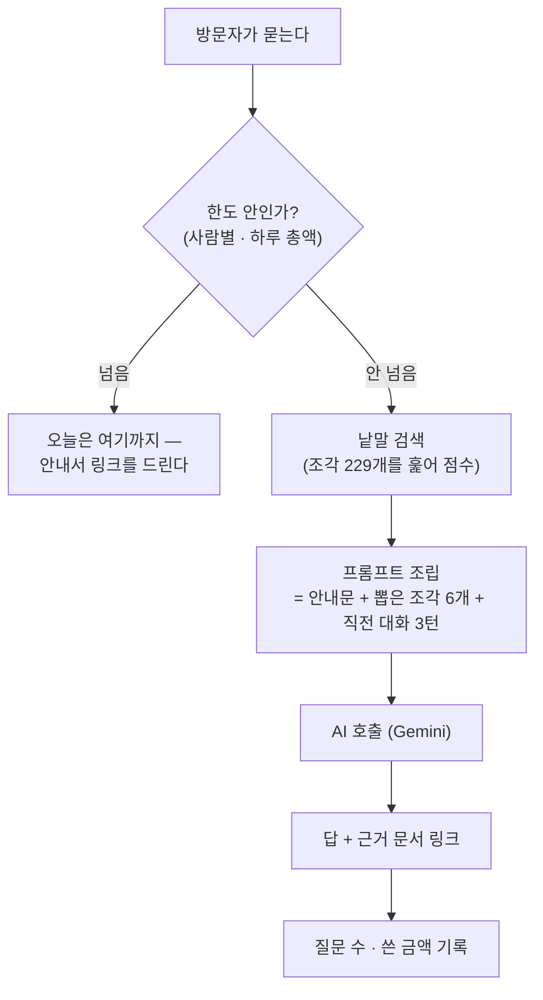

# 나무 클라우드 AI 안내원 설계서

> 📅 2026-08-08 작성 · 대상 서비스 `https://namu-cloud.onnamu.kr`
> 관련 문서: [`namu_cloud_site_design.md`](namu_cloud_site_design.md)(화면 구성의 원본 — 이 설계는 그 위에 얹는다)
>
> **이 문서의 지위** — AI 안내원의 동작과 한도의 **원본**이다. 구현이 이 문서와
> 어긋나면 둘 중 하나를 고쳐야 한다.
>
> **실측 표시** — 이 문서의 숫자에는 두 종류가 있다. `실측`은 명령을 돌려 얻은
> 값이고, `추정`은 계산으로 낸 값이다. 추정에는 반드시 근거와 확인 방법을 적었다.
>
> **📅 2026-08-08 개정 (같은 날 2판)** — 1판은 Anthropic Claude 유료 사용을
> 전제로 썼다. 사용자가 **Google Gemini 무료 등급**으로 정하면서 5-1·6·7·10·11·
> 12·13절을 고쳤다. 값 계산이 사라진 자리에 **요청 수 한도**와 **무료 등급
> 데이터 고지**가 들어왔다. 1판의 근거 문장을 그대로 옮겨 쓰지 말 것 —
> 결론이 같아도 근거가 바뀐 곳이 있다(5-1절 안의 📌 참고).

---

## 1. 왜 만드는가

홈페이지 화면 5장과 펴낸 안내서가 이미 있는데도, 처음 온 사람이 궁금해하는 것은
대개 **문서 사이에 흩어져 있다.** "무료인가요"는 자주 묻는 질문에, "기억이 어디
저장되나요"는 안전 화면에, "터미널에서도 되나요"는 바깥 안내서에 있다. 세 곳을
읽어야 답이 하나 나온다.

읽는 대신 **물어보면 답하는 창구**를 붙인다. 대답의 근거는 이미 쓴 문서들이고,
안내원은 그 문서에서 찾아 답한다.

---

## 2. 사용자가 정한 것 (2026-08-08)

| 무엇 | 정해진 것 |
|---|---|
| 누가 쓰나 | **누구나** — 로그인 전에도 |
| 무엇을 읽나 | **회원용 안내 + 홈페이지 화면 글** (개발 설계서는 넣지 않는다) |
| 화면 모습 | **모든 화면 구석에 말풍선** |
| 비용 방어 | **사람별 한도 + 하루 총액 한도, 둘 다** |
| 어느 AI를 쓰나 | **Google Gemini — 무료 등급** (Flash-Lite 계열) |
| 무료 등급의 데이터 취급 | **쓴다. 대신 말풍선에 고지를 단다** — 유료로 올리지 않는다 |

이 여섯은 사용자 결정이다. 뒤집으려면 사용자에게 먼저 물어야 한다.

> 📌 **무료 등급을 고른 것은 값 때문만이 아니다.** 유료로 가도 질문 하나에 약 9원,
> 하루 200번에 1,700원으로 부담이 크지 않다는 계산을 함께 보고 내린 결정이다
> (2026-08-08). 그러니 나중에 "너무 비싸서 무료를 골랐구나"로 읽고 되돌리지 말 것 —
> 되돌리려면 10-1절의 고지 문구를 떼는 일과 함께 다뤄야 한다.

---

## 3. 지금 있는 것 (2026-08-08 실측)

| 무엇 | 어디 | 상태 |
|---|---|---|
| 공개 화면 5장 | `src/pages.py` → `PAGES` | 있음 (`/` `/start` `/memory` `/safety` `/faq`) |
| 모든 화면의 공통 껍데기 | `src/ui.py` → `page()` | 있음 — **공개 화면과 로그인 뒤 화면이 같은 함수를 쓴다** |
| 공개 주소 목록 | `src/ui.py` → `PUBLIC_PATHS` (= `MENU`에서 파생) | 있음 |
| 주소 분기 | `src/routing_server.py:2061` `_AuthOrMcpDispatcher` | 있음 — `/auth/`로 시작하거나 공개 목록에 있으면 웹, 나머지는 전부 MCP |
| POST 받는 웹 주소 | `src/web_auth.py:2529·2532~2534` | 있음 (`/auth/memo/remove` 등) |
| 서명 쿠키 | `src/web_auth.py:139~189` `_sign_with_expiry` / `_unsign_with_expiry` | 있음 (HMAC-SHA256, `NAMU_SESSION_SECRET`) |
| 한글 검색 색인 | `vendor/namu-agent/namu-plugin/db.py` (FTS5 trigram) | 있음 — 기억 검색이 쓰는 것 |
| AI 열쇠 자리 | `deploy/Dockerfile` | **없음** — 새로 만들어야 한다 |
| 안내 문서를 이미지에 담기 | `deploy/Dockerfile` | **없음** — `src/`·`deploy/`·`namu-plugin/`만 담는다 |

**중요한 실측 두 가지**

**첫째, 말풍선은 한 곳만 고치면 된다.** `ui.page()`가 공개 화면과 로그인 뒤 화면
전부의 껍데기다. 화면 5장을 각각 손댈 필요가 없다.

**둘째, 주소 분기를 건드리지 않아도 된다.** 분기 규칙은 "`/auth/`로 시작하면
웹으로 보낸다"이고, 이 코드에서 `/auth/`는 *로그인이 필요하다*는 뜻이 아니라
*웹 화면 쪽으로 보낸다*는 뜻이다 — 근거: `/auth/github/login`은 로그인하지 않은
사람이 들어오는 첫 문이다. 그래서 답변 주소를 `/auth/ask`로 두면
`_AuthOrMcpDispatcher`와 `PUBLIC_PATHS`를 **한 글자도 고치지 않는다.**

> **버린 선택** — `/ask`를 공개 목록에 넣는 길. `PUBLIC_PATHS`는 `MENU`에서
> 파생되는데, 말풍선은 메뉴에 넣을 것이 아니다. 넣으려면 "메뉴 = 공개 주소"라는
> 규칙을 깨야 하고, 그 규칙은 `routing_server.py`에서 보안 경계를 지키는
> 장치다. 이름이 조금 어색한 쪽(`/auth/ask`)이 보안 코드를 건드리는 쪽보다 낫다.

---

## 4. 안내원이 읽을 글 (말뭉치)

### 4-1. 담은 것 — 만들고 나서 실측 (2026-08-08)

| 문서 | 담긴 글자 | 왜 담나 |
|---|---|---|
| 기억 구조 안내 (`memory_architecture.html`) | 19,440 | "무엇을 기억하나" 계열 질문 |
| 펴낸 안내서 첫 화면 (`index.html`) | 11,966 | 나무 전체 소개 |
| 작업 흐름 안내 (`workflow_architecture.html`) | 8,296 | 터미널 사용자 질문 |
| 클라우드 사용 가이드 (`docs/namu_cloud_guide.md`) | 7,589 | 접속 주소 붙이는 법 |
| 직접 서버 운영 안내 (`remote_mcp_guide.html`) | 7,296 | "내 서버로 돌릴 수 있나" |
| 저장소 소개 한글판 (`README.ko.md`) | 6,979 | 나무가 뭔지 |
| 플러그인 설치 안내 (`install_guide.html`) | 5,818 | 터미널 설치 절차 |
| — 위 일곱 장을 **229조각**으로 나눔 | 67,384 | 검색으로 뽑는 대상 |
| 홈페이지 화면 5장 (`src/pages.py`) | 6,946 | **검색과 무관하게 늘 들어간다** |
| **합계** | **74,330자** | 만드는 데 16밀리초 |

> 📌 **앞 판의 85,212자와 다른 이유** — 앞 판은 파일 크기를 그대로 적었다.
> 실제로 담기는 것은 태그·메뉴·발을 걷어내고 폐기 대목을 뺀 뒤의 글이라 더 적다.
> 홈페이지 화면 글도 12,850 → 6,946으로 줄었는데, 앞 판이 `pages.py`의 **파이썬
> 코드까지** 세고 있었기 때문이다(화면을 그려서 재야 맞는 값이 나온다).

### 4-2. 담지 않은 것

- **개발 설계서** (`plan.md` 22만 자 등) — 사용자 결정. 폐기된 결정이 그대로
  남아 있어, 안내원이 지금은 틀린 말을 사실처럼 할 위험이 크다.
- **파일 첨부 안내** (`docs/namu_attach_files.md`, 4,889자) — **앞 판에서는
  담기로 했다가 뺐다.** 이름만 보면 안내서 같은데 안을 열어 보니 제목이
  "겪은 사고 둘"·"코드 위치"인 **완료 보고서**였다(2026-08-08 확인).
  첨부 기능의 회원용 설명은 홈페이지 `/memory` 화면에 있고, 그 화면 글은
  검색과 무관하게 늘 들어간다. **문서를 고를 때는 파일 이름이 아니라 안의
  제목을 봐야 한다** — 이 한 장이 그 증거다.
- **클라우드 사용 가이드의 "예전 모델(폐기됨)과의 차이" 대목** — 문서는 담되
  이 대목만 뺀다. 폐기된 설계를 지금 사실처럼 말하면 방문자가 없는 기능을
  찾아 헤맨다. 빼는 대목 목록은 `ask_corpus._SOURCES`에 이름으로 적어 둔다
  (짐작으로 거르지 않는다).
- **영문 README** (10,439자) — 한글판과 내용이 겹친다.
- **회원 개인 기억** — 사용자 결정. 로그인 없이 쓰는 창구에 남의 기억이
  닿을 길을 만들지 않는다.

---

## 5. 어떻게 답을 찾나

### 5-1. "통째로 넣기"를 버린 이유

8.5만 자는 요즘 모델의 한 번에 읽는 양에 넉넉히 들어가고, 무료 등급이라 값도
안 든다. 그런데도 통째로 안 넣는다. 이유가 셋이다.

**첫째, 근거 링크를 정확히 달 수 없다.** 조각을 뽑아서 넣으면 그 조각이 어느
문서 어느 대목에서 왔는지 **우리가 안다.** 통째로 넣으면 모델이 스스로 출처를
말해야 하는데, 그 말이 맞는지 우리가 확인할 방법이 없다. 안내원의 답을 방문자가
믿을 수 있게 만드는 것이 근거 링크인데, 그 링크가 지어낸 것이면 없느니만 못하다.

**둘째, 느리다.** 8.5만 자를 매번 읽히면 답이 나오기까지 오래 걸린다. 말풍선은
"물어보면 바로 답이 온다"가 값어치의 전부다.

**셋째, 유료로 올릴 때 그대로 값이 된다.** 지금은 0원이라 티가 안 나지만,
통째로 넣는 구조로 만들어 두면 유료 전환이 곧 값 네 배가 된다.

> 📌 **버린 다른 이유 하나** — 이 설계의 앞 판(2026-08-08 오전)은 Claude 유료
> 기준으로 "캐싱이 안 듣는다"를 통째로 넣기를 버린 주된 근거로 삼았다. 무료
> 등급으로 바꾸면서 **그 근거는 더 이상 성립하지 않는다.** 결론은 같지만 근거가
> 바뀌었으니, 나중에 이 결정을 다시 볼 때 위 셋으로 보라.

### 5-2. 정한 방식 — 낱말 검색으로 필요한 조각만 뽑는다

> **📅 2026-08-08 만들면서 방식을 한 번 바꿨다.** 이 절은 처음에 "코어의 FTS5
> 세글자 색인을 그대로 쓴다"였다. 만들어서 재 보니 시험 질문 일곱 개 중
> **넷이 0건**이었다 — '무료인가요' · '어떻게 시작하나요' · '기억이 어디
> 저장되나요' · '터미널에서도 되나요'. 원인이 둘이다.
>
> 1. **세글자 색인은 두 글자를 원리상 못 찾는다.** 그런데 방문자가 실제로
>    쓰는 말이 '무료'(문서에 6회)·'기억'(170회)·'가입'(5회)처럼 두 글자다.
> 2. **한국어는 낱말에 조사·어미가 붙는다.** '무료인가요'라는 글자열은 문서에
>    없어서, 낱말을 통째로 맞추는 방식으로는 '무료'에 닿지 못한다.
>
> 말뭉치가 **229조각·74,330자**이고 만드는 데 **16밀리초**라, 색인을 따로 두지
> 않고 **그 자리에서 전부 훑어 점수를 매기는** 쪽으로 바꿨다. 아래 5-4절이
> 그 방식이다. 결론(조각만 뽑아 쓴다)은 그대로이고 찾는 방법만 달라졌다.



**저장 장치를 따로 두지 않는다.** 조각은 서버가 뜰 때 문서에서 만들어 메모리에
들고 있는다(74,330자 = 74KB). 문서는 이미지 안에 고정돼 있어(제출 태그로 핀이
박힌 서브모듈) 도중에 바뀌지 않으므로, 낡았는지 볼 일도 다시 만들 일도 없다.

**왜 임베딩(뜻 기반 검색)을 안 쓰나** — Google은 임베딩 창구를 준다. 그러니
"못 쓴다"가 아니라 **안 쓰기로 한 것**이고, 이유는 셋이다.

1. **이미 있다.** 코어에 한글로 검증된 낱말 검색이 있고 기억 검색이 그것을 쓴다.
   임베딩을 쓰면 색인 만드는 코드를 새로 짜고, 색인 파일도 따로 관리해야 한다.
2. **무료 등급에서 아껴야 할 것이 요청 수인데, 임베딩은 그걸 먹는다.** 뜻 기반
   검색은 **질문할 때마다** 그 질문을 임베딩으로 바꿔야 한다 — 질문 1건에 호출이
   1번에서 2번이 된다. (임베딩이 별도 한도를 쓰는지는 확인하지 못했다. 같은
   한도라면 하루에 받을 질문이 절반이 된다.)
3. **말뭉치가 8.5만 자로 작다.** 임베딩이 낱말 검색을 크게 앞서는 것은 문서가
   훨씬 많고 표현이 제각각일 때다. 지금 규모에서는 5-2절의 "바꿔 부르는 말 표"로
   대부분 메워진다.

**뒤집을 조건** — 낱말 검색이 못 찾는 질문이 눈에 띄게 쌓이고, 바꿔 부르는 말
표로도 안 되면 그때 임베딩을 다시 본다. 그전에는 안 만든다.

**낱말 검색의 약점과 대비책** — 문서에 없는 낱말로 물으면 못 찾는다(예: 문서는
"저장소"라고 쓰는데 방문자는 "레포"라고 묻는 경우). 두 가지로 막는다.

1. **홈페이지 화면 글 5장은 검색과 무관하게 항상 넣는다** (6,946자 실측).
   처음 온 사람 질문의 대부분이 여기서 끝나므로, 검색이 빗나가도 답이 나온다.
2. **바꿔 부르는 말 표**를 코드에 둔다 — 레포/저장소, 커넥터/접속 주소,
   메모리/기억 같은 짝을 검색어에 함께 넣는다.

### 5-3. 조각내는 규칙

| 항목 | 값 | 왜 |
|---|---|---|
| 조각 크기 | 약 800자 | 답 한 문단에 필요한 만큼 |
| 겹침 | 앞뒤 150자 | 문단 경계에서 잘려 뜻이 끊기는 것을 막는다 |
| 자르는 자리 | 제목(`#`) 우선, 없으면 빈 줄 | 문장 중간에서 자르지 않는다 |
| 조각마다 붙이는 것 | 문서 이름 · 제목 경로 · 원문 주소 | 답에 근거 링크를 달기 위해 |
| 한 번에 뽑는 개수 | 6개 (실측 1,100~2,100자) | 조각 상한이 800자라도 대부분 그보다 짧다 |
| 찾을 때 보는 곳 | 제목 **과** 본문 | 아래 |

**제목도 찾는 대상에 넣는다.** 처음에는 본문만 봤더니 "claude.ai에 어떻게
붙이나요"가 「2-3. claude.ai에 붙이기」라는 대목을 못 찾았다(2026-08-08 실측)
— 그 낱말이 제목에만 있었기 때문이다. 제목은 그 대목이 무엇에 대한 것인지를
가장 압축해 담은 줄이라, 오히려 본문보다 잘 맞는다.

### 5-4. 점수 매기는 규칙

조각 229개를 전부 훑으며 점수를 매기고 높은 순으로 여섯 개를 뽑는다. 규칙은 넷이다.

| 규칙 | 하는 일 | 없으면 |
|---|---|---|
| **꼬리 떼기** | 낱말에서 뒤를 한 글자씩, **최대 세 글자까지** 떼어 보며 문서에 있는 가장 긴 형태를 찾는다 ('무료인가요' → '무료') | 조사·어미가 붙은 말이 전부 0건 |
| **드문 말에 무게** | 문서에 적게 나오는 말일수록 크게 센다 ('무료' 6회 > '기억' 170회) | 흔한 말만 든 조각이 이긴다 |
| **몇 번 나왔는지** | 같은 말이 여러 번 나온 조각을 위로 (완만하게) | 점수가 같은 조각이 무더기로 나와 순위가 문서 순서로 갈린다 — 실측에서 결과가 안내서 첫 화면 한 곳에 쏠렸다 |
| **길이로 나누기** | 긴 조각이 자동으로 유리해지는 것을 덜어낸다 | 조각 길이가 문서마다 평균 215~505자로 벌어져 있어 긴 문서가 검색을 독차지한다 |

**꼬리를 세 글자까지만 떼는 이유** — 두 글자까지 줄이자 `asdfghjkl`이 `as`가
되어 문서 어딘가에 맞았다(실측). 뜻 없는 글자를 억지로 말뭉치에 붙이는 셈이라,
안내원이 그 조각을 근거처럼 인용하게 된다.

### 5-5. 모르는 것에 0건을 돌려주는 장치

**질문의 뜻 있는 낱말 중 절반 이상이 말뭉치에 있어야** 답을 시도한다. 아니면
빈 목록을 돌려주고, 안내원은 모른다고 답한다.

이 한 줄이 "지어내지 않기"의 핵심이다(10-2절). 점수만으로는 가를 수 없었다 —
"오늘 서울 날씨"의 '오늘'은 문서에 2회뿐이라 **오히려 점수가 높게** 나온다.
맞은 비율로 보면 '오늘' 하나만 맞아 1/3이라 걸러지고, "무료인가요"는 '무료'
하나가 질문의 전부라 1/1로 통과한다.

**검색이 유일한 문지기는 아니다.** 문서에 우연히 있는 낱말('코드' 등)로 물으면
조각이 나올 수 있다. 그건 안내문(시스템 프롬프트)이 받는다 — 두 겹으로 둔다.

> **📅 2026-08-08 4단계에서 정한 것 — 0건이면 AI를 아예 부르지 않는다.**
> 이 절은 "빈 목록을 돌려주고 안내원은 모른다고 답한다"까지만 적어 두어,
> *부르되 모른다고 답하게 하는* 길과 *아예 안 부르는* 길 둘 다로 읽혔다.
> 만들면서 **안 부르는 쪽**으로 정했다. 이유가 셋이다. ①부르지 않으면 지어낼
> 여지가 원리상 없다(모델의 성실함에 기대지 않는다) ②아껴야 할 하루 요청 수를
> 엉뚱한 질문에 쓰지 않는다 ③답이 즉시 나온다.
> **한도도 세지 않는다** — 부르지도 않은 질문으로 방문자의 하루 열 번을 깎을
> 이유가 없다. 대신 이 결정에는 대가가 있다: **홈페이지 화면에만 있는 낱말로
> 물으면 0건이 된다**(검색 대상은 안내 문서 229조각뿐이고 홈페이지 글은 검색
> 대상이 아니다). 시험 질문 12개는 모두 통과하므로 지금은 열어 두고, 실제로
> 그런 질문이 쌓이면 홈페이지 글을 **맞은 비율 판정에만** 더하는 것으로 고친다.

---

## 6. 어느 AI를 쓰나 · 비용

### 6-1. Google Gemini 무료 등급

**돈은 들지 않는다.** 대신 값 대신 **요청 수 제한**이 자원이 된다(7절).

| 항목 | 값 |
|---|---|
| 회사 | Google |
| 모델 | **`gemini-3.5-flash-lite`** (Flash-Lite 계열의 가장 새 안정판) |
| 등급 | 무료 |
| 값 | 0원 |

> **📅 2026-08-08 확인 완료 (1b단계).** 회원 열쇠로 모델 목록을 받아 실제
> 글자열을 확인했다. 앞 판이 추정하던 `gemini-3.1-flash-lite`도 **실제로 있고
> 잘 돈다** — 같은 질문으로 둘 다 왕복해 보고 새 판을 골랐다. 바꾸려면
> `NAMU_ASK_MODEL` 한 줄이면 된다.
>
> **`gemini-flash-lite-latest`(늘 최신을 따라가는 이름)는 쓰지 않는다.** 그
> 이름을 쓰면 어느 날 모델이 조용히 바뀌어 답의 성격이 달라지는데 우리는 알
> 길이 없다. 이 저장소가 코어를 제출 태그로 핀 박아 쓰는 것과 같은 이유다 —
> 바뀌는 것은 우리가 정한 날에만 바뀌어야 한다.

### 6-2. 질문 한 건의 크기 (2026-08-08 실측 — 4단계에서 재서 고침)

값이 0원이어도 크기는 알아야 한다 — 요청 수 제한과 속도가 크기에 걸리기 때문이다.

| 항목 | 앞 판 추정 | **실측** |
|---|---|---|
| 안내문(시스템 프롬프트) | 약 1,500자 | **692자** |
| 홈페이지 화면 글 5장 (항상) | 12,850자 | **6,946자** |
| 검색으로 뽑은 조각 6개 | 약 4,800자 | **1,100 ~ 2,100자** |
| 직전 대화 3턴 | 약 2,000자 | 최대 **1,800자** (한 턴당 질문 200·답 400으로 잘라 넣는다) |
| **들어가는 글자 합계** | 약 21,000자 | **약 9,600 ~ 10,500자** (안내문 포함, 대화까지 꽉 차면 12,300자) |
| **들어가는 토큰 합계** | 약 2만 토큰 | **4,900 ~ 5,400 토큰** |

**추정의 절반 이하로 나왔다.** 어긋난 곳이 둘이다. ①홈페이지 화면 글은 4-1절이
이미 고친 값(6,946자)인데 이 표만 옛 값으로 남아 있었다. ②조각 6개를 "상한
800자 × 6 = 4,800자"로 잡았는데, 실제 조각은 제목 단위로 잘려 대부분 훨씬 짧다
(평균 215~505자). **상한을 곱해 크기를 추정하면 늘 크게 나온다** — 상한은 가장
긴 조각의 크기이지 보통 조각의 크기가 아니다.

**"한국어는 글자 수만큼 토큰이 된다"는 어림이 틀렸다** — 2026-08-08 Google의
토큰 세기 창구로 실제로 재니 **글자 수의 약 절반**(9,569자 → 4,899토큰,
10,487자 → 5,396토큰)이었다. 어림이 두 배 크게 나온 셈이다. 앞 판의 "약 2만
토큰"은 **부풀린 글자 수(21,000자)에 부풀린 환산(1:1)을 곱해** 실제의 네 배가
됐다 — 추정을 곱하면 오차도 곱해진다.

**나중에 유료로 올릴 때를 위한 값** — 앞 판은 "질문 하나에 약 9원"으로 계산했다.
그 계산의 밑값(2만 토큰)이 실제의 네 배였으므로 **실제는 그보다 훨씬 싸다.**
다만 정확한 값은 여기 적지 않는다 — 모델을 3.5로 바꾸었고 그 값표를 확인하지
않았다. 유료를 실제로 검토하는 날 값표부터 다시 본다.

### 6-3. 회사와 모델은 환경변수로 뺀다

```
NAMU_ASK_PROVIDER=gemini          # 나중에 claude 등으로 바꿀 자리
NAMU_ASK_MODEL=<모델 글자열>       # 1단계에서 확인한 값
GEMINI_API_KEY=<열쇠>
```

**왜 이렇게 하나** — 코어의 개발 원칙 1번이 "실행 엔진(AI)은 빌려 쓰고 언제든
교체할 수 있는 부품으로 취급한다"이다(`vendor/namu-agent/CLAUDE.md`). 안내원
하나 때문에 특정 회사에 코드를 못 박지 않는다. 무료 등급이 조건을 바꾸거나
품질이 모자라면 **배포 설정 세 줄만 고쳐** 갈아 끼운다.

`src/ask.py`는 회사별 호출 코드를 함수 하나씩으로 나눠 갖고, 위 환경변수로 고른다.
**지금 만드는 것은 Gemini 쪽 하나뿐이다** — 쓰지도 않을 회사의 코드를 미리 만들지
않는다(안 쓰는 코드는 낡아도 아무도 모른다).

### 6-4. 아끼는 장치

값이 0원이어도 필요하다 — 아끼는 대상이 돈이 아니라 **하루 요청 수**다.

- **답 길이 상한** — 여섯 문장 안쪽으로 답하고 더 필요하면 문서 링크를 주도록
  안내문에 적는다. 답이 짧으면 빠르고, 방문자가 다시 묻는 일도 준다.
- **질문 글자 수 상한 500자** — 긴 글을 통째로 붙여 넣는 것을 막는다.
- **같은 질문 되풀이 막기** — 한 사람이 똑같은 글자를 다시 보내면 앞의 답을
  그대로 다시 보여 준다(호출하지 않는다).

---

## 7. 한도 — 사람별 + 하루 총액

### 7-1. 무료 등급을 쓰면 한도의 성격이 바뀐다

무료 등급으로 가기로 하면서 **하루 총액 한도의 역할이 달라졌다.** 돈이 안 드니
"청구서를 막는" 몫은 사라지고, 대신 **Google이 거는 요청 수 제한 자체가
넘을 수 없는 벽**이 된다. 우리가 세는 것보다 세다 — 우리 코드에 구멍이 있어도
그 벽은 그대로다.

그러면 우리 쪽 세기는 무엇을 하나. **한 사람이 그날 몫을 다 써 버리는 것을 막는다.**
Google의 벽은 "누가 썼는지"를 가리지 않으므로, 한 사람이 아침에 다 긁으면
나머지 방문자는 하루 종일 못 쓴다. 그 몫이 사람별 한도다.

| 겹 | 누가 거나 | 기준 | 값 | 넘으면 |
|---|---|---|---|---|
| 사람별 | **우리** | 서명 쿠키 + 접속 주소(IP) | 하루 **10번** | "오늘은 여기까지입니다 — 안내서를 보세요" + 안내서 링크 |
| 하루 총액 | **우리** | 사이트 전체 | **200번** (Google 하루 한도 낮은 쪽 250의 80%) | 같은 문구 + "내일 다시 열립니다" |
| 하루 총액 | **Google** | 계정 | **250 ~ 1,000번** | 오류로 돌아온다 → 아래 문구 |
| 분당 요청 | **Google** | 계정 | **10 ~ 15번** | "지금 잠깐 붐빕니다, 잠시 뒤 다시 물어보세요" |
| 분당 토큰 | **Google** | 계정 | 250,000 | 위와 같은 문구 |

**우리 총액을 Google 한도의 80%로 두는 이유** — 벽에 그대로 부딪히면 방문자가
보는 것은 딱딱한 오류다. 20%를 남겨 두면 우리가 먼저 부드러운 문구로 받는다.
남긴 20%는 개발자가 확인할 때 쓴다.

**묶이는 것은 토큰이 아니라 요청 수다.** 질문 하나가 약 1만 토큰(6-2절 실측)이니
분당 토큰 한도 25만에 닿으려면 분당 25번을 물어야 하는데, **요청 수 한도가
10~15번에서 먼저 걸린다.** 그래서 아끼는 대상은 언제나 요청 수 하나다 — 프롬프트를
줄여도 받을 수 있는 질문 수는 늘지 않는다.

> **📅 2026-08-08 — 회원이 알려준 값으로 채웠다.** 위 숫자는 회원이 열쇠를 만든
> 뒤 알려준 것이다. **다만 아직 범위다**(하루 250~1,000회·분당 10~15회) — Flash
> 계열 전체를 묶은 값이라 우리 계정의 Flash-Lite 한 줄이 정확히 얼마인지는
> 여전히 모른다. 그래서 **낮은 쪽(250)을 기준으로 잡았다.** 높은 쪽으로 잡았다가
> 실제가 낮으면 방문자가 딱딱한 오류를 보게 되고, 반대는 우리가 조금 덜 쓰는
> 것으로 끝난다 — 틀렸을 때의 대가가 한쪽으로 크게 기운다.
>
> 값은 환경변수(`NAMU_ASK_DAILY_CAP`)라 다시 빌드하지 않고 고친다. 나중에
> `aistudio.google.com/rate-limit`에서 Flash-Lite 한 줄의 정확한 숫자를 보면
> 그때 올린다.

### 7-2. 어떻게 세나

- **사람 구분** — 첫 질문 때 서명 쿠키를 하나 발급한다. 이미 있는
  `_sign_with_expiry`(`web_auth.py:144`)를 그대로 쓴다. 쿠키는 지울 수 있으므로
  **접속 주소(IP)로 한 겹 더 센다** — 둘 중 하나라도 한도를 넘으면 막는다.
- **어디에 세나** — `NAMU_STORE_ROOT` 아래 파일 한 장(`ask_counters.json`).
  메모리에만 두면 컨테이너가 다시 뜰 때 세던 값이 사라져 한도가 무의미해진다.
  이 폴더는 볼륨이라 다시 떠도 남는다(`deploy/entrypoint.sh` 참고).
- **언제 초기화하나** — 한국 시각 자정. 코어의 `cfg.now()`를 쓴다 —
  `datetime.now()`를 직접 쓰면 컨테이너 시각(UTC)이 찍혀 9시간 어긋난다.

### 7-3. 못 막는 것 (솔직히 적는다)

접속 주소를 바꿔 가며 부르는 것은 이 방식으로 못 막는다.

**다만 무료 등급이라 잃을 것이 돈이 아니다.** 최악의 경우 잃는 것은 **그날의
요청 수**뿐이고, 자정이면 돌아온다. 청구서가 열릴 길은 애초에 없다 — 무료
등급을 고른 것의 숨은 이득이 이것이다.

나중에 유료로 올리면 이 문단이 거짓이 된다. **올리는 날 이 절을 함께 고칠 것.**

---

## 8. 화면 — 말풍선

### 8-1. 모습

```
                                          ┌──────────────────────────┐
                                          │ 🌳 나무에게 물어보기   ✕ │
                                          ├──────────────────────────┤
                                          │                          │
                                          │  안녕하세요. 나무 클라우드│
                                          │  에 대해 궁금한 것을      │
                                          │  물어보세요.             │
                                          │                          │
                                          │  · 나무가 뭔가요?        │
                                          │  · 무료인가요?           │
                                          │  · 어떻게 시작하나요?    │
                                          │                          │
                                          ├──────────────────────────┤
                                          │ [                ] [보냄]│
                                          │ ⓘ 질문은 Google AI로 갑니│
                                          │   다. 개인정보·열쇠는 적지│
                                          │   마세요.          자세히↗│
                                          └──────────────────────────┘
                                                          ┌─────┐
                                                          │ 💬  │  ← 접었을 때
                                                          └─────┘
```

- 오른쪽 아래 구석. 처음에는 동그란 단추만 보이고, 누르면 펼쳐진다.
- 처음 펼쳤을 때 **예시 질문 세 개**를 눌러 볼 수 있게 둔다 — 빈 칸만 있으면
  무엇을 물어야 할지 몰라 그냥 닫는다.
- 답에는 **근거 문서 링크**를 단다.
- **고지 한 줄이 입력 칸 바로 아래 늘 보인다**(10-1절). 접히지 않는다 —
  접어 두면 아무도 안 편다.

### 8-2. 지켜야 할 것

| 항목 | 규칙 |
|---|---|
| 바깥 파일 | 안 쓴다 — CSS·JS를 `ui.py` 안에 문자열로 둔다(지금 사이트 방식 그대로) |
| 어두운 화면 | `SITE_CSS`의 색 변수만 쓴다. 색을 새로 박지 않는다 |
| 휴대폰 폭 | 480px 아래에서는 화면을 거의 꽉 채우게 편다 |
| 화면 낭독기 | 단추에 이름을 붙이고, 답이 도착하면 읽히도록 표시한다 |
| 자바스크립트가 꺼져 있으면 | 단추를 아예 그리지 않는다 (`<noscript>`로 감춘다) |

### 8-3. 어디에 붙나

`ui.page()` 한 곳. 인자 `ask=True`(기본값)로 두고, 끄고 싶은 화면만 `False`를
준다. 화면 5장을 각각 손대지 않는다.

---

## 9. 파일 구성

| 파일 | 역할 | 새로 만드나 |
|---|---|---|
| `src/ask_corpus.py` | 안내 문서 모으기 → 태그 걷기 → 조각내기 → 점수 매겨 찾기 | ✅ 완료 |
| `src/ask.py` | 한도 검사 · 프롬프트 조립 · **AI 호출(회사별로 함수 하나씩)** · 답 다듬기 | ✅ 완료 |
| `src/ask_limit.py` | 사람별/총액 세기, 자정 초기화 | ✅ 완료 |
| `src/ui.py` | 말풍선 조각(`ask_widget()`) 추가, `page()`에서 부름 | ✅ 완료 |
| `src/pages.py` | 안전 화면에 고지 문단(10-1절) | ✅ 완료 |
| `src/web_auth.py` | `/auth/ask` (POST) 라우트 한 줄 추가 | ✅ 완료 |
| `deploy/Dockerfile` | 안내 문서 COPY | 고침 |
| `pyproject.toml` | **안 고친다** — 아래 | — |
| `src/routing_server.py` | **안 고친다** (3절 참고) | — |

**Gemini 의존을 새로 넣지 않았다.** 앞 판은 회사 SDK를 넣을 셈이었는데, 이
저장소는 이미 `httpx`를 직접 의존으로 갖고 있고(`github_app.py`가 GitHub API에
쓴다) Gemini도 주소 하나에 POST 한 번이면 끝난다. 부르는 곳이 `ask.call_gemini`
함수 하나뿐이라 SDK가 줄여 줄 것이 없다 — **의존 하나를 안 늘리는 쪽이 낫다**
(늘리면 배포 이미지·보안 갱신·버전 충돌이 따라온다).

**말뭉치는 언제 만드나** — 서버가 뜰 때 한 번, 메모리에. 16밀리초 걸리고 74KB를
쓴다. 문서가 이미지 안에 고정돼 있어 도중에 바뀌지 않으므로 낡았는지 볼 일이 없다.

**세기 파일은 어디에 두나** — `NAMU_ASK_DATA_DIR`, 없으면 `NAMU_STORE_ROOT/ask`.
**회원 기억이 놓이는 `users/` 아래에는 절대 두지 않는다** — 운영 데이터와 회원
기억을 같은 폴더에 섞지 않는 것이 이 저장소의 규칙이다(`src/identity.py` 첫머리).

---

## 10. 안전

### 10-1. 무료 등급 고지 — 이 설계에서 가장 중요한 한 줄

Google 이용약관 원문(2026-08-08 확인):

> **무료 등급** — "Google은 회원이 서비스에 보낸 내용과 생성된 응답을 Google
> 제품을 제공·개선·개발하는 데 사용합니다." 그리고 **"사람 검토자가 입력과
> 출력을 읽고 주석을 달 수 있습니다."**
> **유료 등급** — "Google은 회원의 입력이나 응답을 제품 개선에 사용하지 않습니다."

우리는 무료 등급을 쓰기로 했다. **나가는 것은 방문자가 직접 친 글뿐이다** —
회원 개인 기억은 말뭉치에 없고 읽는 함수도 부르지 않는다(4-2절). 그래도
고지가 필요한 이유는 값이 아니라 **우리가 이미 한 약속** 때문이다. 안전 화면에
"원본은 회원님 GitHub에 있고 서버는 사본만 갖는다"고 써 둔 사이트가, 말풍선에
친 글이 남의 학습에 쓰이는 것을 말하지 않으면 그 약속이 거짓이 된다.

**말풍선에 늘 보이는 문구** (입력 칸 바로 아래, 접히지 않음):

> ⓘ 이 창의 질문은 Google AI로 보내집니다. 무료 등급이라 Google이 학습에 쓸 수
> 있고 사람이 읽을 수도 있습니다. **개인정보나 접속 열쇠는 적지 마세요.**
> [자세히](/safety)

**안전 화면(`/safety`)에도 같은 내용을 문단으로 넣는다.** 말풍선의 한 줄은
좁아서 다 못 담고, 방문자가 "자세히"를 눌렀을 때 갈 곳이 있어야 한다.

**유료로 올리는 날 이 절 전체를 다시 쓴다** — 고지를 떼는 것은 약관이 바뀌는
일이므로, 코드만 고치고 문구를 남겨 두면 이번엔 반대 방향으로 거짓이 된다.

### 10-2. 나머지 위험

| 위험 | 대비 |
|---|---|
| 방문자가 안내원에게 "지시"를 심는 것 | ①안내문에 "나무에 대한 질문에만 답한다"를 못 박고 ②방문자 글은 별도 칸에 넣어 지시문과 섞지 않는다 ③**완전히 막을 수는 없다** — 그래서 안내원에게는 도구를 하나도 주지 않는다. 글을 돌려주는 일밖에 못 한다 |
| 답이 화면을 깨뜨리는 것 | 답은 **글자로만** 화면에 넣는다(HTML로 해석하지 않는다). 줄바꿈과 링크만 우리가 만든다 |
| 안내원이 개인 기억을 보는 것 | 볼 길 자체가 없다 — 말뭉치에 안 담고, 기억을 읽는 함수를 부르지 않는다 |
| 열쇠가 새는 것 | 열쇠는 이미지에 굽지 않고 배포 환경변수로만 넣는다(지금 다른 비밀값과 같은 방식) |
| AI 호출이 실패하는 것 | 실패해도 홈페이지는 멀쩡해야 한다 — 말풍선 안에서만 "지금은 답할 수 없습니다, 안내서를 보세요"로 끝낸다. **무료 등급에는 가동률 약속이 없으므로** 이 길이 드물게 아니라 종종 쓰인다고 보고 만든다 |
| 방문자가 열쇠·비밀번호를 적어 넣는 것 | 고지로 막는 것이 1차(10-1절). 2차로, 보내기 전에 **화면에서** 열쇠처럼 생긴 글자(`ghp_`·`sk-`·`gho_` 등으로 시작하는 긴 글자)를 찾으면 보내지 않고 경고한다 — 서버로 넘어간 뒤에는 이미 늦다 |
| 안내원이 모르는 것을 지어내는 것 | 안내문에 **"문서에서 찾지 못하면 모른다고 말하고 안내서 링크를 준다"**를 못 박는다. 근거 링크를 늘 붙이게 해, 링크가 없으면 방문자도 의심할 수 있게 한다 |

---

## 11. 사용자가 직접 해야 하는 일

~~첫째 — Google AI Studio에서 무료 열쇠를 만듭니다.~~ **✅ 2026-08-08 완료.**

~~둘째 — 그 화면에서 하루 한도 숫자를 알려주십시오.~~ **✅ 2026-08-08 받았습니다**
(7-1절 표에 넣었습니다. 아직 범위라 낮은 쪽을 기준으로 잡았습니다).

**남은 것은 하나 — onnamu-project 배포 설정에 아래 세 줄을 넣습니다.**

```
GEMINI_API_KEY=<만드신 열쇠>
NAMU_ASK_PROVIDER=gemini
NAMU_ASK_MODEL=gemini-3.5-flash-lite
```

이 일은 **8단계(배포) 때 하시면 됩니다.** 지금 넣어도 화면에는 아무 변화가
없습니다 — 말풍선은 6단계에서 처음 생깁니다.

**열쇠가 없으면 말풍선 단추를 아예 안 그립니다.** 그래서 셋째를 하기 전에
배포해도 홈페이지는 지금과 똑같이 동작합니다 — 순서가 어긋나도 사고가 나지
않게 한 것입니다.

---

## 12. 작업 순서

| # | 할 일 | 결과물 | 사용자가 볼 수 있는 것 |
|---|---|---|---|
| 1 | 말뭉치 모으기·조각내기 | `ask_corpus.py` | ✅ 229조각·74,330자, 16밀리초 |
| 2 | 낱말 검색 | `ask_corpus.py` | ✅ 시험 질문 12개 전부 답, 엉뚱한 질문 5개 전부 0건 |
| 3 | 한도 세기 | `ask_limit.py` | ✅ 검사 50개 통과 |
| 4 | Gemini 호출·프롬프트 | `ask.py` | ✅ 검사 29개 통과 |
| 1b | **토큰 재기** + **모델 이름 글자열 확인** | — | ✅ 모델 확정 · 토큰 실측 · **실제 왕복 성공**(1.2~1.6초) |
| 5 | `/auth/ask` 라우트 | `web_auth.py` | ✅ 검사 19개 통과 · 주소로 답이 온다 |
| 6 | 말풍선 화면 + **고지 한 줄** | `ui.py` | ✅ 검사 9개 통과 · 열쇠 없으면 안 그려짐 |
| 7 | **안전 화면에 고지 문단** | `pages.py` | ✅ `/safety`에 문단이 생겼다 |
| 8 | 배포 (Dockerfile·버전 올림) | 라이브 | 실제 사이트에서 한 바퀴 |

**되돌리기 안전판** — 1~5단계까지는 화면에 아무것도 안 나타난다. 6단계에서
처음 보이고, 열쇠를 빼면 그 즉시 단추가 사라진다.

**7단계를 6단계와 떼지 않는다** — 말풍선이 살아 있는데 안전 화면에 고지가 없는
기간이 생기면, 그동안 우리는 방문자에게 알리지 않고 글을 넘기는 셈이 된다.
**둘은 같은 배포에 함께 나간다.**

---

## 13. 검증

**자동 검사** (`uv run pytest tests/ -q`)

- `tests/test_ask_corpus.py` — 조각이 문장 중간에서 안 잘리는가 / 열 개 질문에
  실제로 칠 법한 질문 12개가 전부 답을 찾는가 / 엉뚱한 질문 5개가 전부 0건인가 /
  개발 문서와 폐기 대목이 안 섞였는가 / 결과가 한 문서에 쏠리지 않는가
- `tests/test_ask_limit.py` — 사람별·총액이 각각 막는가 / 자정에 초기화되는가 /
  컨테이너가 다시 떠도 세던 값이 남는가
- `tests/test_ask.py` — 열쇠가 없으면 부르지 않는가 / **0건이면 AI를 아예 안
  부르는가** / **근거 링크가 우리가 보낸 목록에서만 나오는가**(모델이 아무 번호나
  말해도 없는 주소는 안 나간다) / AI가 어떻게 터져도 예외가 밖으로 안 나가는가 /
  방문자 글이 자료 뒤 맨 끝에 놓이는가 / 안내문에서 약속 세 문장이 조용히
  빠지지 않았는가. **네트워크를 한 줄도 타지 않는다** — `ask._PROVIDERS`의 호출
  함수 하나만 갈아 끼우면 나머지 전부를 확인할 수 있게 만들어 두었다
- `tests/test_routing_server.py` — **`/auth/ask`가 MCP 쪽으로 새지 않는가** /
  이상한 주소가 여전히 인증 쪽으로 가는가 (회귀 검사)
- `tests/test_ui.py` — 열쇠가 없으면 단추가 안 그려지는가 /
  **말풍선이 그려질 때 고지 문구가 반드시 함께 있는가**(10-1절이 조용히 빠지는
  것을 막는 검사다 — 이 검사가 이 설계에서 가장 지키고 싶은 한 줄이다)
- `tests/test_pages.py` — 안전 화면에 고지 문단이 있는가

**손으로 확인 (배포 후, 순서대로)**

1. 열쇠 없이 배포 — 홈페이지가 지금과 똑같은가, 단추가 안 보이는가
2. 열쇠 넣고 다시 배포 — 단추가 보이는가
3. 말풍선을 폈을 때 **고지 한 줄이 바로 보이는가** (스크롤 없이)
4. "나무가 뭔가요" — 답과 근거 링크가 오는가
5. "무료인가요" — 자주 묻는 질문 화면 내용으로 답하는가
6. "오늘 서울 날씨" — 모른다고 하고 안내서로 보내는가
7. 열쇠처럼 생긴 글자를 넣어 본다 — 보내지 않고 경고하는가
8. 열한 번째 질문 — 사람별 한도 문구가 나오는가
9. 어두운 화면·휴대폰 폭에서 안 깨지는가 (고지 줄이 잘리지 않는가)

---

## 14. 이번 범위 밖

- 회원 개인 기억을 읽는 안내원 (다른 물건이다 — 로그인 필수·격리 설계 필요)
- 개발 설계서를 읽는 안내원 (폐기된 결정 표시 장치가 먼저 필요)
- 답 품질에 대한 방문자 평가(👍/👎) 수집
- 한국어 말고 다른 언어
- 대화 내용 저장 — **저장하지 않는다.** 지금 창에서만 살아 있고 창을 닫으면
  사라진다(개인정보를 만들지 않는 것이 가장 싼 개인정보 대책이다)
- **유료 등급으로 올리기** — 지금은 안 한다. 올릴 때 함께 고쳐야 할 곳은
  2절(결정)·6절(값)·7-3절(못 막는 것)·10-1절(고지) 넷이다. 코드만 고치고
  고지를 남겨 두면 이번엔 반대 방향으로 거짓말이 된다
