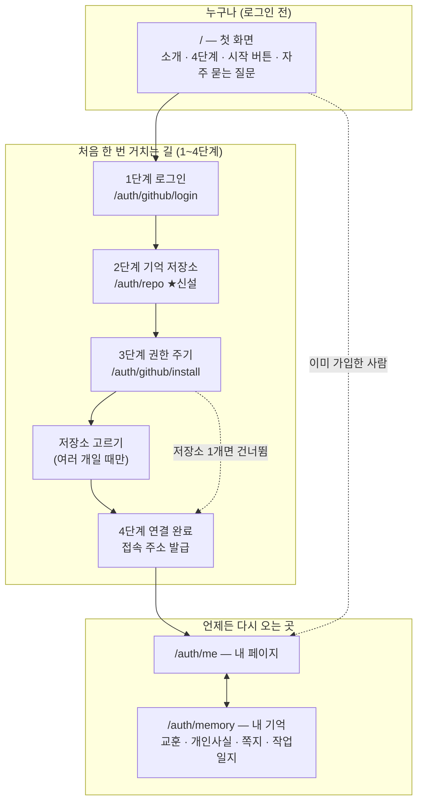
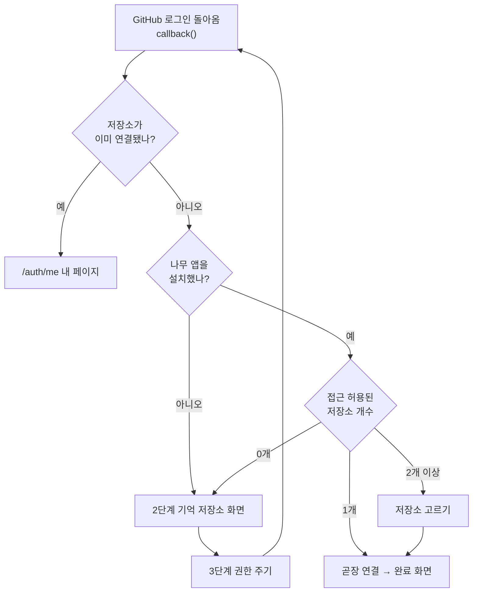
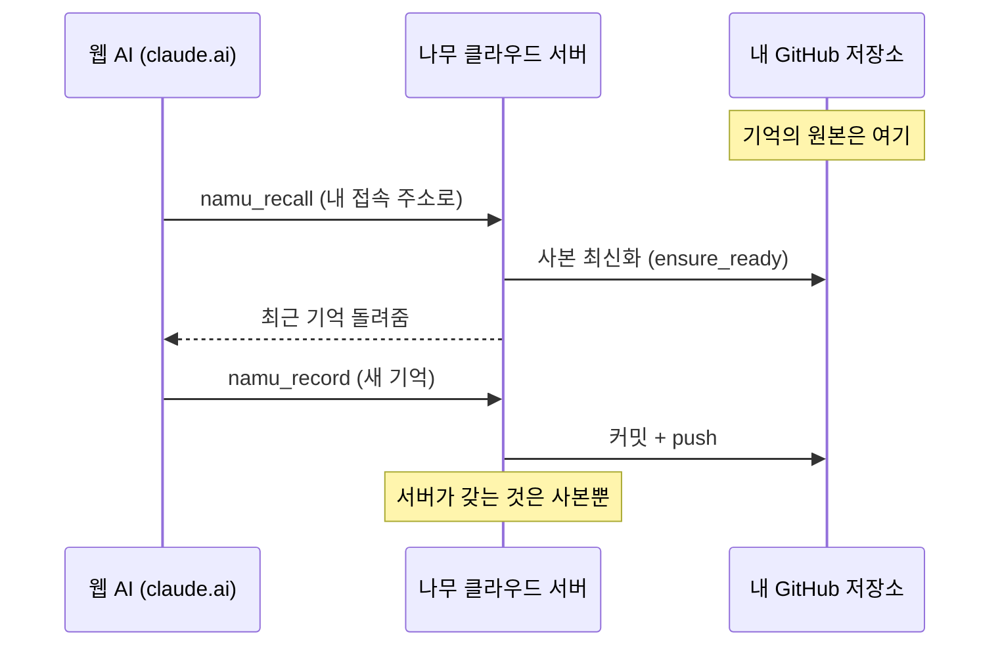

# 나무 클라우드 홈페이지 설계서 (namu-70)

> 📅 2026-08-01 작성 · 대상 서비스 `https://namu-cloud.onnamu.kr`
> 관련 문서: [`namu_cloud_guide.md`](namu_cloud_guide.md)(사용 가이드 — 이 설계가 구현되면 개정 대상)
>
> **이 문서의 지위** — 화면 구성과 흐름의 **원본**이다. 구현이 이 문서와 어긋나면 둘 중
> 하나를 고쳐야 하며, 화면 절차를 다른 문서에 다시 적지 않는다(두 곳에 적으면 한쪽만
> 고쳐지는 사고가 이 프로젝트에서 반복됐다).
>
> **📅 2026-08-08 현행화** — 이 설계서를 쓴 2026-08-01에는 그릇이 셋(교훈·개인 사실·쪽지),
> 노출 도구가 셋이었다. 그 뒤 두 가지가 들어왔다: ①`namu-file-upload-download`로
> **첨부 기록 그릇**이 생기고 파일 도구 7종이 붙어 노출 도구가 **10종**이 됐다
> ②`fts5-memo-tasks-index`로 검색이 **다섯 그릇 전부**로 넓어졌고, 작업일지는 쓰기까지
> 열렸다. 본문의 "그릇 3~4개"·"도구 3개"는 전부 **그릇 다섯·도구 열**로 읽는다.
> 화면 문구의 실제 원본은 `src/pages.py`이며 그쪽이 코드와 함께 갱신된다.

---

## 1. 왜 만드는가

`namu-agent` 저장소·안내서·광고를 보고 관심이 생긴 사람이 최종적으로 도착하는 주소가
`https://namu-cloud.onnamu.kr` 이다. 그런데 **그 주소는 지금 아무것도 없다.**

```
$ curl https://namu-cloud.onnamu.kr/
{"error": "not found"}        ← 404 (2026-08-01 실측)
```

로그인 이후 화면(내 페이지·내 기억·연결 완료)은 namu-58~60에서 이미 만들어 살아 있는데
**들어오는 문이 없다.** 그 화면들에 닿으려면 `/auth/github/login` 이라는 속주소를 직접
알아야 하고, 지금은 안내서가 그 속주소를 알려주는 방식으로 때우고 있다(가이드 2-2절).

처음 온 사람이 실제로 막히는 두 지점:

| 막히는 곳 | 지금 상태 |
|---|---|
| GitHub에 기억 저장소를 만들어 나무와 잇기 | 새 탭으로 GitHub에 보내고 끝 — 돌아오는 길·확인 단계가 없다 |
| 웹 AI에 붙일 접속 주소 만들기 | 이미 자동 발급된다 (잘 되어 있음) |

**목표** — 낯선 사람이 이 주소에 도착한 순간부터 "내 AI가 내 기억을 읽고 쓴다"까지,
다른 문서를 찾아 헤매지 않고 **화면만 따라가면 끝나는 하나의 길**.

---

## 2. 지금 있는 것 (2026-08-01 실측)

| 화면 (함수) | 주소 | 상태 |
|---|---|---|
| 첫 화면 | `/` | **없음 (404)** |
| 로그인 | `/auth/github/login` | 있음 |
| 다음 단계 `_html_next_steps` | 콜백 응답 | 있음 — **순서가 뒤집혀 있음**(3-B) |
| 앱 설치 | `/auth/github/install` | 있음 |
| 저장소 선택 `_html_select_repo(_multi)` | 콜백 응답 | 있음 |
| 연결 완료 `_html_connected` | 콜백 응답 | 있음 (접속 주소 발급) |
| 내 페이지 `_html_me_connected` | `/auth/me` | 있음 |
| 내 기억 `_html_memory_page` | `/auth/memory` | 있음 (그릇 5개 — 2026-08-08 현재) |

**핵심 코드 위치**

| 위치 | 무엇 |
|---|---|
| `src/web_auth.py` (2152줄) | 화면 전부 + 로그인 왕복. `_BASE_CSS`(398) · `_html_page`(423) · `_html_onboarding_section`(514) · `_html_next_steps`(658) · `callback`(1140) · `build_auth_app`(2127) |
| `src/routing_server.py:834` | `_AuthOrMcpDispatcher` — `/auth/`로 시작하면 웹, **나머지 전부 MCP**. `/`가 404인 이유 |
| `src/identity.py` | 가입자 장부(사용자키·설치번호·저장소·접속열쇠) |
| `src/user_repo.py:255` | `ensure_ready` — **빈 저장소(커밋 0개) 이미 대응**. 새로 만든 저장소를 붙여도 그대로 동작 |
| `src/web_auth.py:663` | **이름·비공개가 미리 채워진 저장소 생성 링크가 이미 있다**(namu-58, 2026-07-26). `github.com/new?name=namu-memory&visibility=private` — 사용자는 [Create] 한 번만 누르면 된다. **없는 것은 만들고 돌아왔을 때 이어갈 길뿐이다** |

**디자인 자산** — `namu-agent/docs/*.html` 6종이 청록색 디자인 체계(CSS 변수·카드·다크모드·
공통 상단 메뉴 `namu-docnav`)를 이미 갖추고 있다. 클라우드 사이트는 이걸 쓰지 않고 최소
스타일(`_BASE_CSS`)만 쓴다.

---

## 3. 사람 한 명을 따라가 보기

### A. 이야기

> 지수는 GitHub에서 namu-agent를 봤다. "대화가 끝나도 AI가 기억한다"는 문장이 마음에 들었다.
> 터미널은 안 쓰고 claude.ai만 쓴다. 광고에 적힌 `namu-cloud.onnamu.kr`을 눌렀다.

| # | 지수가 하는 일 | 지수가 알고 싶은 것 | 화면이 답해야 할 것 |
|---|---|---|---|
| 0 | 첫 화면 도착 | 이게 뭐지? 나한테 필요한가? | 한 문장 소개 + 4단계 그림 + **"터미널 쓰면 여기 말고 저기"** |
| 1 | GitHub 로그인 | 내 코드를 다 보겠다는 건가? | 신원 확인만 한다는 것 |
| 2 | 기억 저장소 준비 | 저장소가 뭐고 왜 필요하지? | **버튼 하나로 만들어 주기** (또는 있는 것 고르기) |
| 3 | 나무에 권한 주기 | 왜 또 승인 화면이지? | 아까는 신원, 이번은 저장소 접근 — 다른 화면임 |
| 4 | 접속 주소 받기 | 이 긴 주소를 어디다 넣지? | 복사 버튼 + claude.ai 붙이는 법 4줄 |
| 5 | 되돌아오기 | 주소를 잃어버렸다 | 내 페이지에 언제나 있다 |

### B. 지금 순서가 뒤집혀 있는 지점 (반드시 고칠 것)

`_html_next_steps`(658줄)가 화면에 내는 순서:

```
1) [NAMU 앱 설치하고 저장소 연결하기]                  ← 먼저 눈에 띄는 링크
2) 저장소가 아직 없다면 만드세요 → [새 저장소 만들기]    ← 아래에 딸린 문장
```

그런데 **앱 설치 화면이 곧 "어느 저장소에 접근을 허용할지 고르는 화면"** 이다.
저장소가 없는 사람이 1번을 먼저 누르면 고를 게 없는 화면(`_html_no_repos`)을 만나고,
돌아오는 길도 없다. → **저장소가 먼저, 권한이 나중.**

### C. 갈림길 — 이 사이트가 맞는 사람인지 먼저 가른다

| 무엇을 쓰나 | 어디로 | 왜 |
|---|---|---|
| 웹 AI (claude.ai·ChatGPT 등) | **이 사이트** | 접속 주소를 커넥터에 붙인다 |
| 터미널 (Claude Code·agy) | **플러그인 설치 안내서** | 이 주소로는 기억과 파일만 넘어간다 — 세션 브리핑·`/namu-task`·마무리 훅은 따라오지 않는다 |

터미널 사용자를 이 길로 흘려보내면 반쪽짜리 나무를 쓰면서 기억까지 두 곳(`~/.namu`와
GitHub 저장소)으로 갈라진다. **첫 화면 맨 위에서 갈라야 한다.**

---

## 4. 사이트 지도



### 로그인한 사람을 어느 화면으로 보낼지



> **아직 없는 판정을 새로 만들지 않는다.** 위 판정은 `callback`(1140줄)에 이미 전부 있다.
> 2단계 화면만 새로 끼워 넣고, `_html_next_steps` 자리를 그 화면으로 바꾸는 것이다.

### 기억이 실제로 어디에 있는가 (사용자에게 설명할 그림)



---

## 5. 화면별 명세

### 5-1. `/` 첫 화면 ★신설

| 칸 | 내용 |
|---|---|
| 머리 | 🌳 나무 클라우드 / "대화가 끝나도 남는 AI 기억" / **[GitHub으로 시작하기]** |
| 갈림길 | 3-C 표 — 터미널 사용자는 여기가 아니라 플러그인 설치 안내서로 |
| 4단계 그림 | ① 로그인 ② 기억 저장소 ③ 권한 ④ 주소 받아 AI에 붙이기 |
| 무엇이 생기나 | ⓐ 내 GitHub 안 비공개 저장소 하나 ⓑ 나만의 접속 주소 하나 |
| 안심시키기 | 원본은 **회원님 GitHub에** 있고 서버는 사본만 갖는다 / 나무는 회원님이 고른 저장소 하나만 본다 / 언제든 주소 폐기 가능 |
| 자주 묻는 질문 | 무료인가 · 저장소가 뭔가 · 비공개로 해도 되나 · 다른 PC에서도 되나 · 그만두려면 |
| 발 | 안내서 6종 + GitHub 링크 (`namu-docnav`와 같은 줄) |

로그인 상태면 시작 버튼이 **[내 페이지로]** 로 바뀐다.

### 5-2. `/auth/repo` 2단계 — 기억 저장소 ★신설 (`_html_next_steps` 대체)

이 화면이 이번 작업의 심장이다. 두 갈래를 **한 화면에서** 준다.

```
┌─────────────────────────────────────────────┐
│  ●─●─○─○   2단계 / 4단계                     │  ← 진행 표시
│  기억을 담을 저장소를 마련합니다               │
│                                             │
│  ▸ 저장소가 뭔가요?            (접힌 설명)    │
│    회원님 GitHub 안의 폴더 하나입니다. 나무가  │
│    남기는 기억이 전부 여기 파일로 쌓입니다.    │
│    원본은 회원님 것이고, 서버는 사본만 봅니다. │
│                                             │
│  ┌───────────────────────────────────────┐  │
│  │ ⓐ 새로 만들기  (권장)                  │  │
│  │                                       │  │
│  │   1. [ GitHub에서 만들기 ↗ ]           │  │
│  │      이름(namu-memory)과 비공개가       │  │
│  │      미리 채워진 채로 열립니다 —        │  │
│  │      [Create] 한 번만 누르세요.         │  │
│  │                                       │  │
│  │   2. [ 만들었어요, 다음 → ]             │  │  ← 지금 없는 것 ★
│  └───────────────────────────────────────┘  │
│                                             │
│  ⓑ 이미 있어요 → [ 있는 저장소 고르기 ]       │
└─────────────────────────────────────────────┘
```

**핵심 — 새로 만들 것은 2번 버튼 하나다.**
1번(미리 채워진 링크)은 `web_auth.py:663`에 **이미 있다.** 지금은 새 탭으로 보내고 끝이라,
만들고 돌아온 사람이 이어갈 곳이 없다. 그 하나 때문에 흐름이 끊긴다.

- 두 걸음을 **번호로 세워** 보여준다 — 지금은 "만드세요" 한 문장 아래 링크만 있어서,
  만든 다음에 무엇을 해야 하는지가 화면에 없다.
- **[만들었어요, 다음]** 은 3단계(권한 주기)로 곧장 넘긴다. 이때 저장소 이름을 **서명 쿠키**에
  담아 두었다가, 3단계 콜백에서 그 이름이 목록에 있으면 고르기 화면을 건너뛰고 곧장 연결한다.
- 새 탭에서 이름을 바꿔 만든 사람도 막히지 않는다 — 쿠키의 이름이 목록에 없으면 평소대로
  고르기 화면이 나온다.

### 5-3. 3단계 권한 주기 (기존 보강)

`_html_next_steps`의 좋은 설명을 그대로 살려 이 단계로 옮긴다 —
"방금 지나온 화면은 **신원 확인만** 했고, 이번이 저장소 접근 권한을 주는 **별도 화면**이다."
(2026-07-26 실측으로 확인된 사용자 혼란 지점)

추가: 진행 표시 + "다음 화면에서 **`namu-memory`** 를 고르세요"(방금 만든 이름을 그대로 박음).

### 5-4. 4단계 연결 완료 (기존 `_html_connected` 보강)

- 진행 표시 `●─●─●─●`
- 접속 주소 + 복사 버튼 — `_html_mcp_url_section` 그대로 재사용
- **마지막 할 일 체크리스트** — claude.ai 설정 → 커넥터 → 사용자 정의 커넥터 추가 → 붙여넣기
- [내 페이지로]

### 5-5. `/auth/me` 내 페이지 (기존 유지, 차림새만)

기능은 전부 유지. 세 덩어리를 카드로 분리 — ① 접속 주소 ② 내 기억·열린 작업
③ 주소 관리(연결 시험·재발급·폐기).

### 5-6. `/auth/memory` 내 기억 (기존 유지, 차림새만)

그릇 5개(교훈·개인 사실·작업일지·쪽지·첨부 기록) 열람·검색·쪽지 떼기.
**읽기 전용 원칙 유지**(쪽지 떼기만 예외).

---

## 6. 기술 설계

### 6-1. 파일 구성

| 파일 | 역할 | 왜 나누나 |
|---|---|---|
| `src/ui.py` ★신설 | 디자인 토큰(CSS) · `page()` · `notice()` · `stepper()` · `section()` · `steps()` · `faq()` · 상단 메뉴(`MENU`)와 발 | 공개 페이지와 로그인 화면이 **같은 껍데기**를 써야 하는데, `web_auth.py`에 두면 공개 페이지가 로그인 모듈에 의존하는 뒤집힌 구조가 된다 |
| `src/pages.py` ★신설 | 공개 페이지 5장 | 로그인이 필요 없는 화면 — 인증 코드와 섞지 않는다. 세션 여부는 인자(`logged_in`)로 받는다 |
| `src/web_auth.py` | 기존 + 공개 라우트 5개 + `/auth/repo` 2개 | `_BASE_CSS`·`_html_page`는 `ui.py`로 옮기고 여기서는 불러 쓴다 |

> **파일 이름이 `site.py`가 아닌 이유** — `site`는 파이썬이 기동할 때 이미 불러
> 두는 표준 모듈 이름이라, 같은 이름을 두면 우리 파일이 **영원히 안 불린다.**

**신설 라우트**

| 메서드 | 경로 | 하는 일 |
|---|---|---|
| GET | `/` | 홈 |
| GET | `/start` | 시작하기 — 가입부터 AI에 붙이기까지 |
| GET | `/memory` | 무엇을 기억하나 — 3층·다섯 그릇·파일 주고받기 |
| GET | `/safety` | 안전 — 원본 위치·권한 범위·주소 관리·그만두기 |
| GET | `/faq` | 자주 묻는 질문 |
| GET | `/auth/repo` | 2단계 화면 |
| GET | `/auth/repo/done` | "만들었어요, 다음" → 저장소 이름을 서명 쿠키에 담고 3단계로 |

**메뉴는 한 곳(`ui.MENU`)에서 온다** — 상단 메뉴·발·라우트 등록·디스패처 공개
경로가 전부 이 목록을 본다. 두 곳에 손으로 적으면 "메뉴에는 있는데 눌러도
404"가 생긴다(이 프로젝트에서 반복된 사고 양식이다).

### 6-2. 첫 화면이 404가 아니게 만들기 — 가장 조심할 곳

`_AuthOrMcpDispatcher`(`routing_server.py:834`)의 현재 안전 규칙은
**"`/auth/`로 시작하지 않으면 전부 인증 있는 쪽(MCP)"** 이다. 이 기본값을 절대 뒤집지 않는다.

```python
# 정확히 일치하는 공개 경로만 목록으로 허용한다. startswith가 아니라 ==로 보는
# 이유: 접두어 비교는 "/…/mcp" 같은 조작에 문이 열릴 여지를 만든다. 목록에
# 없으면 종전대로 MCP 쪽(닫히는 방향)으로 간다. 목록은 메뉴와 같은 곳에서 온다.
_PUBLIC_PATHS = frozenset(ui.PUBLIC_PATHS)   # = ui.MENU의 경로들

if scope["type"] == "http" and (path.startswith("/auth/") or path in _PUBLIC_PATHS):
    await self.auth_app(scope, receive, send)
    return
await self.mcp_app(scope, receive, send)
```

`tests/test_routing_server.py`에 회귀 검사를 반드시 함께 넣는다 — `/`만 첫 화면을 내고,
`/mcp` 계열과 이상한 경로는 여전히 인증 쪽으로 가는지.

### 6-3. 저장소는 사이트가 만들지 않는다 — 이미 정해진 방침

**나무 앱에 저장소 관리(Administration) 권한을 추가하지 않는다.** 사이트가 대신
`POST /user/repos`를 부르는 길은 **버린다.**

**왜** — GitHub은 그 권한을 쪼개서 주지 않는다. "만들기"만 얻을 수 없고
**"생성·삭제·설정·팀·협업자"가 한 덩어리**다. 그러면 앞으로 **모든 사용자의 설치 승인
화면에 "이 앱이 저장소를 삭제할 수 있다"** 는 줄이 뜬다. 기억을 맡기는 서비스가 첫인상으로
치를 값이 아니다. 얻는 것은 클릭 두어 번이다.

**대신 쓰는 길 (이미 코드에 있다 — namu-58, `web_auth.py:663`)**

```
https://github.com/new?name=namu-memory&visibility=private
```

이름과 비공개가 **미리 채워진 채로** GitHub 생성 페이지가 열린다. 사용자가 하는 일은
[Create] 한 번. 권한 요청이 하나도 늘지 않는다.

> 📌 이 방침은 namu-58 때 이미 이 형태로 구현됐다. 2026-08-01 설계 초안이 이것을
> "새로 만들 기능"으로 잘못 올렸다가 되돌린 것이니, **다시 자동 생성으로 뒤집지 말 것.**
> 뒤집으려면 위 "설치 화면 문구" 대가를 먼저 다시 검토해야 한다.

**그래서 이번에 새로 만드는 것은 버튼 하나다** — `[만들었어요, 다음]`(`/auth/repo/done`).
만들고 돌아온 사람을 3단계로 넘기고, 저장소 이름을 서명 쿠키에 실어 보내 3단계 콜백에서
고르기 화면을 건너뛰게 한다.

### 6-4. 디자인 체계 이식

`namu-agent/docs/namu_cloud_guide.html`의 CSS 변수를 `src/ui.py`로 옮긴다.

```
--accent      #0f766e (밝을 때) / #4fd6c6 (어두울 때)
--bg-card, --border, --radius 14px, --maxw 800px   … 다크모드 대응 포함
```

지금 흩어진 인라인 `style="padding:8px 16px;…"` 약 15군데를
`.btn` / `.btn-primary` / `.card` / `.step` 클래스로 걷는다.

**손대지 않을 것** — `_MCP_URL_COPY_SCRIPT`(467)와 `_html_mcp_test_script`(753).
id 기준으로 붙어 있어 클래스 교체와 무관하고, 건드리면 namu-69에서 잡은 UX가 회귀한다.

### 6-5. 진행 표시

`ui.stepper(current, total=4)` 하나로 2·3·4단계에 같은 모양을 낸다.
그림만이 아니라 글자로도 읽히게 `2단계 / 4단계 — 기억 저장소`를 함께 적는다(화면 낭독기).

---

## 7. 작업 순서

| # | 할 일 | 결과물 | 상태 |
|---|---|---|---|
| 1 | 설계 문서(이 문서) 저장 | `docs/namu_cloud_site_design.md` | ✅ |
| 2 | `src/ui.py` 분리 — 디자인 체계·껍데기·진행표시 | 기존 화면이 새 옷을 입고 그대로 동작 | ✅ |
| 3 | 공개 페이지 **5장** + 디스패처 공개 경로 | 404 사라짐, 메뉴가 생김 | ✅ 커밋 `4e1aefb` |
| 4 | 2단계 화면 신설 + 순서 뒤집기 + `[만들었어요, 다음]` | 끊긴 흐름이 이어짐 | ✅ |
| 5 | 3·4단계 보강 (진행표시·체크리스트) | — | ✅ 진행표시·카드 |
| 6 | 내 페이지·내 기억 카드 정리 | — | ✅ |
| 7 | 문서 현행화 (8절) | 안내서 4종 | — |
| 8 | 배포 v0.1.20 | 라이브 | **실측** |

> **3단계가 커진 이유** — 애초 계획은 첫 화면 한 장이었으나, 2026-08-01 사용자
> 판단으로 **메뉴가 있는 사이트**로 넓혔다. 안내서 HTML을 옮겨 쓰지 않고
> 현행 사실로 새로 썼다(옛 문서에는 폐기된 설명이 남아 있다 — 8절).

**사용자가 직접 해야 하는 준비는 없다** — GitHub 앱 설정을 건드리지 않기 때문이다(6-3).

**되돌리기 안전판** — 3단계까지만 해도 사이트는 완결된다(첫 화면이 생기고 기존 흐름은
그대로 동작한다). 4단계가 끊긴 흐름을 잇는 본체다.

---

## 8. 안내서 현행화 (같은 릴리스에 포함)

사이트가 바뀌는 순간 `namu_cloud_guide.md` 2-2절이 틀린 글이 된다. 미루면 안내서가
거짓말하는 기간이 생기고, 먼저 하면 바뀔 절차를 두 번 쓰게 된다.

| 문서 | 무엇이 틀렸나 |
|---|---|
| `namu-agent/docs/namu_cloud_guide.html` | **`?user=` 서랍 라우팅**으로 설명 — namu-59에서 폐기. 기준일 07-19. `.md`는 07-31에 고쳤는데 HTML만 안 고쳐짐 |
| `docs/namu_cloud_guide.md` 2-2절 | 절차가 새 흐름과 달라짐 → 사이트를 가리키도록 짧게 |
| `namu-agent/README.md` · `README.ko.md` | 안내서 표에 **클라우드 주소가 없음** — 유입 경로 자체가 빠져 있다 |
| `namu-agent/docs/remote_mcp_guide.*` | 경로 A 링크를 사이트 첫 화면으로 |

**원칙** — 절차를 안내서에 다시 적지 않는다. 안내서는 사이트를 가리키고,
**절차의 원본은 화면 자체**가 된다.

---

## 9. 검증

**자동 검사** — `uv run pytest tests/ -q`

- `tests/test_routing_server.py` — `/`가 첫 화면을 내는지 / `/mcp` 계열이 여전히 인증 쪽인지
  / 이상한 경로가 공개로 새지 않는지
- `tests/test_web_auth.py` — 2단계 화면이 상태별로 맞게 나오는지 / `[만들었어요, 다음]`이
  저장소 이름을 실어 3단계로 넘기는지 / **그 이름이 목록에 없을 때도 막히지 않고** 평소대로
  고르기 화면이 나오는지 (GitHub 호출은 `_http_json` 한 곳만 가로챈다)

**손으로 확인 (배포 후, 순서대로)**

1. 로그아웃 상태로 `https://namu-cloud.onnamu.kr/` — 첫 화면이 뜨는가
2. [GitHub으로 시작하기] → 2단계 저장소 화면까지 오는가
3. [저장소 만들기] — 성공/실패 어느 쪽이든 **다음 길이 화면에 보이는가**
4. 권한 → 연결 완료 → 주소 복사 → [연결 시험] 통과
5. claude.ai 커넥터에 붙여 `namu_recall` 한 번
6. 창 닫고 `/auth/me` 다시 열기 — 주소가 그대로 있는가
7. 어두운 화면 설정·휴대폰 폭에서 깨지지 않는가

**배포** — onnamu-project 쪽 버전 핀 4곳: `server_architecture_specs.md`,
`namu-cloud/docker-compose.yml`, `.github/workflows/deploy.yml`(`--branch` / `-t`).
클라우드 코어 핀 검사(`scripts/check_cloud_core_pin.sh`)를 먼저 통과시킬 것.

---

## 10. 이번 범위 밖

- 결제·요금제 — 지금은 소수 사용자 체험 단계
- 조직(Organization) 계정 저장소 — 개인 계정만
- 웹에서 기억 쓰기·고치기 — 읽기 전용 유지(쪽지 떼기만 예외)
- 로그인 방식 추가(구글 등) — GitHub 하나
